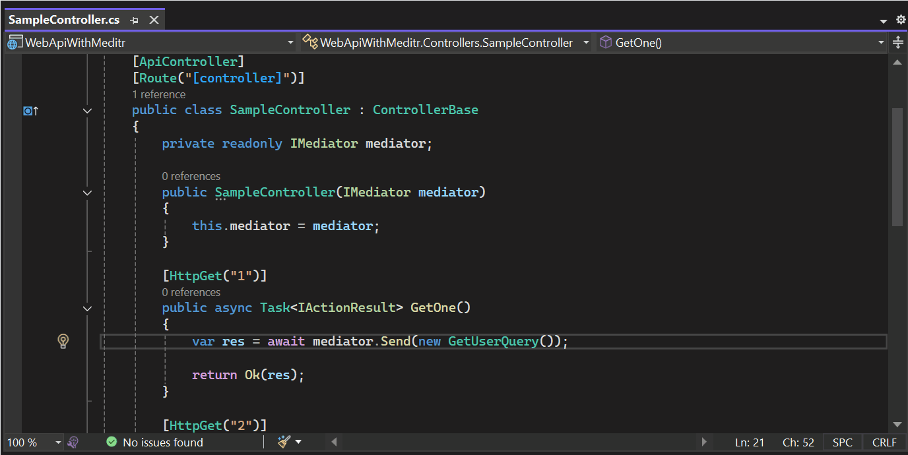
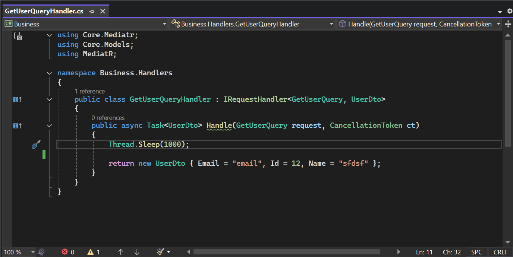

## MediatR Navigation Extension (Visual Studio 2022)

Jump instantly between MediatR requests/notifications and their handlers, and from handlers to Send/Publish call sites. Fast, context‑aware, and built for VS 2022.

### Commands
| Command | From | To | Shortcut |
|---|---|---|---|
| Go to MediatR Implementation | Request/Command/Query/Notification | Handler(s) | Ctrl+Alt+F12 |
| Go to MediatR Send/Publish | Handler | Usage locations | Ctrl+Alt+F11 |

### Key features
- Smart context detection (only shows relevant command)
- Supports multiple handlers with a selection dialog
- Finds Send/Publish usages (direct, variable, parameter scenarios)
- Precise Roslyn‑based navigation to method signatures
- Works solution‑wide; optimized for performance

### Quick start
- Request → Handler: place the caret on a MediatR request/notification, press Ctrl+Alt+F12 (or use Edit/Context menu).
- Handler → Usages: place the caret on a handler class or Handle method, press Ctrl+Alt+F11.

### Supported patterns
- **Requests**: `IRequest`, `IRequest<TResponse>`
- **Notifications**: `INotification`
- **Handlers**: 
  - `IRequestHandler<TRequest>`, `IRequestHandler<TRequest,TResponse>`
  - `INotificationHandler<TNotification>`
  - `IStreamRequestHandler<TRequest,TResponse>` (streaming)
  - `IRequestExceptionHandler<TRequest,TResponse,TException>` (exception handling)
  - `IRequestExceptionAction<TRequest,TException>` (exception actions)

### Requirements
- Visual Studio 2022-2026 (17.0-18.x)
- .NET Framework 4.7.2+
- Your project references MediatR

### Installation
- Marketplace

### Notes
- If a command doesn’t appear, ensure you’re in a C# file and the caret is on a relevant symbol, the solution builds, and MediatR is referenced.

### License
MIT