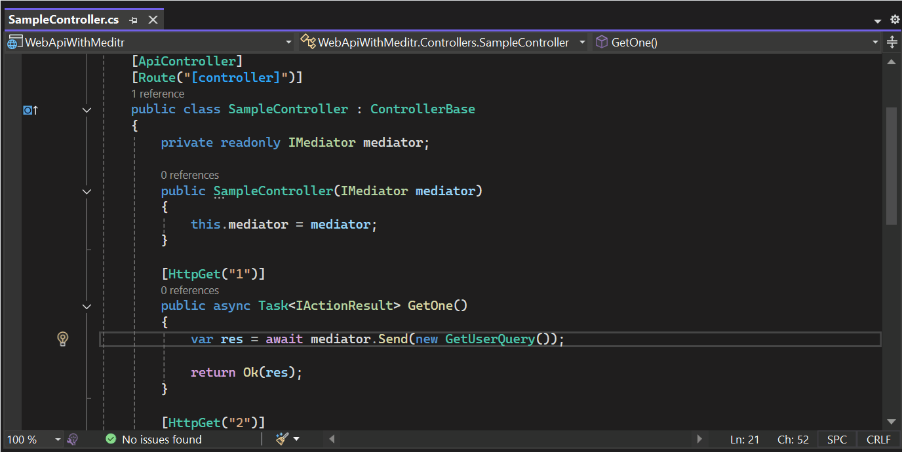
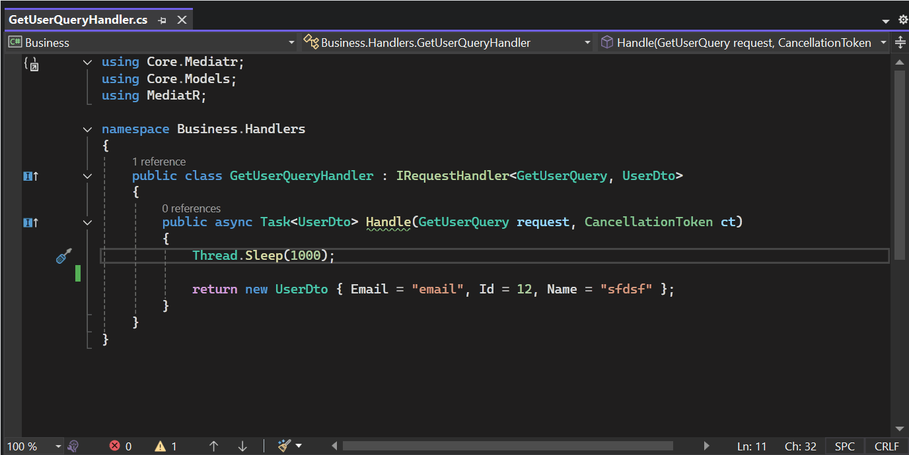

## MediatR Navigation Extension (Visual Studio 2022+)

Jump instantly between MediatR requests/notifications and their handlers, and from handlers to Send/Publish call sites. Fast, context‑aware, and built for VS 2022.

### Commands
| Command | From | To | Shortcut |
|---|---|---|---|
| Go to MediatR Implementation | Request/Command/Query/Notification | Handler(s) | Ctrl+Alt+F12 |
| Go to MediatR Send/Publish | Handler | Usage locations | Ctrl+Alt+F11 |

### Key features
- Smart context detection (only shows relevant command)
- Supports multiple handlers with a selection dialog
- Finds Send/Publish usages (direct, variable, parameter scenarios)
- Precise Roslyn‑based navigation to method signatures
- Works solution‑wide; optimized for performance
- **CodeLens** — shows handler count and usage count inline above every MediatR type and its Handle/Execute/Process methods

### Quick start
- Request → Handler: place the caret on a MediatR request/notification, press Ctrl+Alt+F12 (or use Edit/Context menu).
- Handler → Usages: place the caret on a handler class or Handle method, press Ctrl+Alt+F11.

### Supported patterns
- **Requests**: `IRequest`, `IRequest<TResponse>`
- **Notifications**: `INotification`
- **Handlers**:
  - `IRequestHandler<TRequest>`, `IRequestHandler<TRequest,TResponse>`
  - `INotificationHandler<TNotification>`
  - `IStreamRequestHandler<TRequest,TResponse>`
  - `IRequestExceptionHandler<TRequest,TResponse,TException>`
  - `IRequestExceptionAction<TRequest,TException>`
  - `IPipelineBehavior<TRequest,TResponse>`
  - `IStreamPipelineBehavior<TRequest,TResponse>`
  - `IRequestPreProcessor<TRequest>` (`MediatR.Pipeline`)
  - `IRequestPostProcessor<TRequest,TResponse>` (`MediatR.Pipeline`)

### Settings
Options page at **Tools → Options → MediatR Navigation**:

**CodeLens**
| Setting | Default | Description |
|---|---|---|
| Enable CodeLens integration | On | Show handler and usage counts inline above MediatR types and handler methods |
| Refresh delay (seconds) | 3 | How long to wait after a code change before refreshing counts. Higher values reduce CPU usage |

**Commands**
| Setting | Default | Description |
|---|---|---|
| Enable Go to Implementation command | On | Show the *Go to MediatR Implementation* command in menus |
| Enable Go to Usage command | On | Show the *Go to MediatR Send/Publish* command in menus |

**Razor**
| Setting | Default | Description |
|---|---|---|
| Enable Razor Support | On | Enable navigation commands in `.razor` Blazor component files. CodeLens and `.razor.cs` code-behind files work regardless of this setting |

### Razor / Blazor support
- `.razor.cs` **code-behind files** are supported out of the box (no setting required).
- **Navigation commands** ("Go to Handler", "Go to Usages") work inside `.razor` component files when the cursor is on a MediatR type inside a `@code {}` block.
- Enabled by default; disable via **Tools → Options → MediatR Navigation → Razor → Enable Razor Support**.
- CodeLens is not yet supported in `.razor` source files; it works in `.razor.cs` code-behind files.
- `.cshtml` (Razor Views / MVC) files are not supported.

### Requirements
- Visual Studio 2022-2026 (17.0-18.x)
- .NET Framework 4.7.2+
- Your project references MediatR

### Installation
- Marketplace

### Notes
- If a command doesn’t appear, ensure you’re in a C# or `.razor` file and the caret is on a relevant symbol, the solution builds, and MediatR is referenced.

### License
MIT
