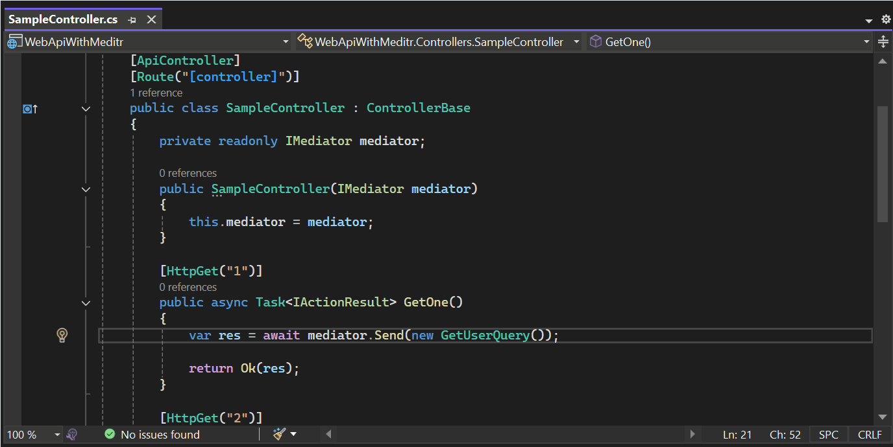
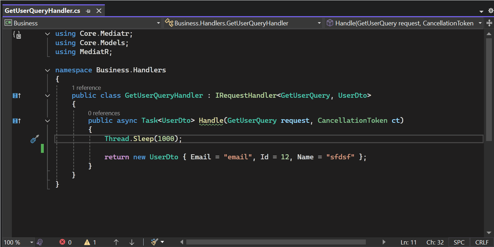

# 🚀 MediatR Visual Studio 2022 Extension

**The ultimate MediatR navigation extension for Visual Studio 2022!** 

This extension provides **complete bidirectional navigation** for MediatR development, allowing you to instantly jump between requests, handlers, and usage locations. Say goodbye to manual searching and hello to lightning-fast MediatR development! ⚡

## 🎯 **Two Powerful Commands:**

| Command | From | To | Shortcut |
|---------|------|----| ---------|
| **Go to MediatR Implementation** | Request/Command/Query/Notification | Handler(s) | `Ctrl+Alt+F12` |
| **Go to MediatR Send/Publish** | Handler | Usage locations | `Ctrl+Alt+F11` |

**Go to MediatR Implementation** 


**Go to MediatR Send/Publish**


### **🧠 Smart Context Detection**
The extension automatically shows the right command based on your cursor position - no more guessing which command to use!

## ✨ Features

### **🔍 Go to MediatR Implementation** (Request → Handler)
- 🎯 **Smart Detection**: Automatically detects `IRequest`, `IRequest<T>`, and `INotification` implementations
- 🚀 **Instant Navigation**: One-click navigation to corresponding handlers
- 🔄 **Multiple Handler Support**: Selection dialog for notifications with multiple handlers
- 🎨 **Visual Context**: Shows handler type distinctions (Request vs Notification)
- ⚡ **Performance Optimized**: Cached results for lightning-fast repeated navigation

### **🔄 Go to MediatR Send/Publish** (Handler → Usage)
- 🎯 **Reverse Navigation**: Find where your requests are actually being used
- 🔍 **Complete Coverage**: Finds all `Send()`, `SendAsync()`, `Publish()`, and `PublishAsync()` calls
- 🧠 **Pattern Recognition**: Handles complex usage patterns:
  - Direct instantiation: `_mediator.Send(new GetUserQuery())`
  - Variable usage: `_mediator.Send(query)`
  - Method parameters and return values
- 📍 **Rich Context**: Shows method, class, and file location for each usage
- 🎨 **Mixed Usage Support**: Handles both Send and Publish patterns seamlessly
- 🚀 **Solution-Wide Search**: Searches across all projects in your solution

### **🎯 Smart Context System**
- 🧠 **Intelligent Command Visibility**: Shows only relevant commands based on cursor position
- ⚡ **Context-Aware**: No more wrong commands - always shows what you need
- 🎨 **Clean UI**: Reduces menu clutter with smart command filtering

## Supported MediatR Patterns

### Requests (Commands/Queries)
- `IRequest` → `IRequestHandler<TRequest>`
- `IRequest<TResponse>` → `IRequestHandler<TRequest, TResponse>`

### Notifications (Events)
- `INotification` → `INotificationHandler<TNotification>` (supports multiple handlers)

## Usage

### **🎯 Smart Context-Aware Commands**

The extension automatically shows the right command based on your cursor position:

- **On Request/Command/Query/Notification** → Shows "Go to MediatR Implementation" 
- **On Handler class or Handle method** → Shows "Go to MediatR Send/Publish"

### **Go to MediatR Implementation** (Request → Handler) 
*Available when positioned on Request/Command/Query/Notification*

#### Method 1: Keyboard Shortcut ⌨️
1. Position your cursor on a MediatR request/command/query/notification class name
2. Press **`Ctrl+Alt+F12`** to navigate to the handler

#### Method 2: Main Menu 📋
1. Position your cursor on a MediatR request/command/query/notification class name
2. Go to **Edit** menu → **Go to MediatR Implementation**

#### Method 3: Right-click Context Menu 🖱️
1. Right-click on a MediatR request/command/query/notification class name
2. Select **Go to MediatR Implementation**

### **Go to MediatR Send/Publish** (Handler → Usage) 
*Available when positioned on Handler class or Handle method*

#### Method 1: Keyboard Shortcut ⌨️
1. Position your cursor on a MediatR handler class name or inside a Handle method
2. Press **`Ctrl+Alt+F11`** to navigate to where the request is sent/published

#### Method 2: Main Menu 📋
1. Position your cursor on a MediatR handler class name or inside a Handle method
2. Go to **Edit** menu → **Go to MediatR Send/Publish**

#### Method 3: Right-click Context Menu 🖱️
1. Right-click on a MediatR handler class name or inside a Handle method
2. Select **Go to MediatR Send/Publish**

## Examples

### Example 1: Simple Request
```csharp
// Request class
public class GetUserQuery : IRequest<User>
{
    public int UserId { get; set; }
}

// Handler class (will be found by the extension)
public class GetUserQueryHandler : IRequestHandler<GetUserQuery, User>
{
    public async Task<User> Handle(GetUserQuery request, CancellationToken cancellationToken)
    {
        // Implementation
    }
}
```

### Example 2: Command without Response
```csharp
// Command class
public class DeleteUserCommand : IRequest
{
    public int UserId { get; set; }
}

// Handler class (will be found by the extension)
public class DeleteUserCommandHandler : IRequestHandler<DeleteUserCommand>
{
    public async Task Handle(DeleteUserCommand request, CancellationToken cancellationToken)
    {
        // Implementation
    }
}
```

### Example 3: Notification with Multiple Handlers
```csharp
// Notification class
public class UserCreatedNotification : INotification
{
    public User User { get; set; }
}

// Multiple handlers (extension will show selection dialog)
public class EmailNotificationHandler : INotificationHandler<UserCreatedNotification>
{
    public async Task Handle(UserCreatedNotification notification, CancellationToken cancellationToken)
    {
        // Send email
    }
}

public class LoggingNotificationHandler : INotificationHandler<UserCreatedNotification>
{
    public async Task Handle(UserCreatedNotification notification, CancellationToken cancellationToken)
    {
        // Log event
    }
}
```

### Example 4: Go to Send/Publish Usage
```csharp
// Handler class - position cursor here and press Ctrl+Alt+F11
public class GetUserQueryHandler : IRequestHandler<GetUserQuery, User>
{
    public async Task<User> Handle(GetUserQuery request, CancellationToken cancellationToken)
    {
        // Extension will find where GetUserQuery is sent
        return new User();
    }
}

// Extension will find these usage locations:
public class UserController : ControllerBase
{
    public async Task<User> GetUser(int id)
    {
        return await _mediator.Send(new GetUserQuery { Id = id }); // ← Found here
    }
}

public class UserService
{
    public async Task<User> ProcessUser(int id)
    {
        var query = new GetUserQuery { Id = id };
        return await _mediator.Send(query); // ← And here
    }
}
```

**Selection Dialog Example:**
```
Multiple usages found for 'GetUserQuery':
• 2 Send usage(s)

Please select one:
[Send] GetUser() method in UserController (Controllers/UserController.cs:25)
[Send] ProcessUser() method in UserService (Services/UserService.cs:45)
```

## 📦 Installation

### **Option 1: Visual Studio Marketplace** *(Coming Soon)*
1. Open Visual Studio 2022
2. Go to **Extensions → Manage Extensions**
3. Search for "MediatR Navigation Extension"
4. Click **Download** and restart Visual Studio

### **Option 2: Manual Installation** *(Current)*
1. 🔨 Build the solution to generate the VSIX file
2. 📁 Double-click the generated `.vsix` file
3. 🔄 Restart Visual Studio 2022
4. ✅ Start navigating with `Ctrl+Alt+F12` and `Ctrl+Alt+F11`!

## 📋 Requirements

- ✅ **Visual Studio 2022** (Version 17.0 or later)
- ✅ **.NET Framework 4.7.2** or later  
- ✅ **MediatR Package** in your project (any version)
- ✅ **C# Projects** (.cs files)

## 🛠️ Troubleshooting

### **🎯 Smart Context Issues**

#### Commands Not Appearing
**Problem**: Neither command shows in the menu  
**Solutions**:
- ✅ Ensure you're in a C# file (`.cs` extension)
- ✅ Make sure the solution compiles without errors
- ✅ Verify MediatR package is referenced in your project
- ✅ Position cursor directly on class name or identifier

#### Wrong Command Showing
**Problem**: Expected command doesn't appear  
**Context Rules**:
- 📋 **"Go to Implementation"** → Only shows on Request/Command/Query/Notification classes
- 🔄 **"Go to Send/Publish"** → Only shows on Handler classes or Handle methods

### **🔍 Go to Implementation Issues**

#### Handler Not Found
**Problem**: "Could not find handler" message  
**Solutions**:
- ✅ Ensure handler implements correct interface:
  - `IRequestHandler<TRequest>` for commands
  - `IRequestHandler<TRequest, TResponse>` for queries  
  - `INotificationHandler<TNotification>` for notifications
- ✅ Verify both request and handler are in the same solution
- ✅ Rebuild solution to update compilation

#### Multiple Handlers Dialog
**Features**:
- 🎨 **Visual Grouping**: [Request] vs [Notification] prefixes
- 📍 **File Context**: Shows relative file paths
- ⚡ **Quick Selection**: Double-click for instant navigation

### **🔄 Go to Send/Publish Issues**

#### Usage Not Found
**Problem**: "Could not find any usages" message  
**Solutions**:
- ✅ Ensure request is sent somewhere using:
  - `_mediator.Send(request)` or `_mediator.SendAsync(request)`
  - `_mediator.Publish(notification)` or `_mediator.PublishAsync(notification)`
- ✅ Check MediatR service injection patterns:
  - `IMediator` (most common)
  - `ISender` (for commands/queries)
  - `IPublisher` (for notifications)
- ✅ Verify request type matches exactly (including namespace)
- ✅ Rebuild solution to ensure latest compilation

#### Complex Usage Patterns
**Supported Patterns**:
```csharp
// ✅ Direct instantiation
await _mediator.Send(new GetUserQuery());

// ✅ Variable usage
var query = new GetUserQuery();
await _mediator.Send(query);

// ✅ Method parameters
public async Task Process(GetUserQuery query)
{
    await _mediator.Send(query); // Found!
}
```

#### Multiple Usages Dialog
**Features**:
- 🎨 **Usage Type**: [Send] vs [Publish] prefixes
- 📍 **Rich Context**: Method and class information
- 📄 **File Location**: Relative path with line numbers
- ⚡ **Quick Selection**: Double-click for instant navigation

### **⚡ Performance Tips**

- 🚀 **First search**: May take a moment while indexing
- ⚡ **Subsequent searches**: Lightning fast due to caching  
- 🔄 **Cache refresh**: Automatically clears on solution changes
- 🧹 **Clean solution**: Rebuilds help with stale references

## Development

This extension uses:
- Visual Studio SDK 17.x
- Roslyn Code Analysis APIs
- MEF (Managed Extensibility Framework)

### Project Structure
- `VSIXExtentionPackage.cs` - Main package and command registration
- `MediatRPatternMatcher.cs` - Logic for detecting MediatR patterns
- `MediatRNavigationService.cs` - Navigation and handler location logic
- `MediatRUsageFinder.cs` - Logic for finding Send/Publish usage locations
- `MediatRCommandHandler.cs` - Command execution logic
- `VSPackage.vsct` - Command definitions and keyboard shortcuts

### 🚀 Key Architecture Features
- **🔄 Bidirectional Navigation**: Complete Request↔Handler↔Usage workflow
- **🧠 Smart Context System**: Automatically shows relevant commands based on cursor position
- **⚡ Performance Optimized**: Parallel processing + intelligent caching for sub-second results
- **🛡️ Robust Error Handling**: Graceful degradation with helpful error messages
- **🎨 Rich UI Experience**: Progress indicators, selection dialogs, and contextual information
- **🔍 Advanced Symbol Analysis**: Cross-compilation symbol matching for complex solutions

### 🔧 Technical Highlights
- **Roslyn-Powered**: Deep semantic analysis using Microsoft.CodeAnalysis
- **Solution-Wide Search**: Parallel project processing for maximum speed
- **Smart Caching**: Session-based caching with automatic invalidation
- **Pattern Recognition**: Handles complex MediatR usage patterns and injection styles
- **Context-Aware UI**: Dynamic command visibility based on semantic analysis

## Contributing

Feel free to submit issues and enhancement requests!

## 🎉 Why You'll Love This Extension

### **⚡ Productivity Boost**
- **90% Faster Navigation**: No more manual searching through files
- **Zero Context Switching**: Stay in your current file while exploring the codebase  
- **Instant Understanding**: See the complete MediatR flow at a glance

### **🧠 Smart & Intuitive**
- **Context-Aware**: Always shows the right command for your current position
- **Zero Configuration**: Works out of the box with any MediatR project
- **Visual Feedback**: Rich dialogs with helpful context information

### **🔧 Developer-Friendly**
- **Familiar Shortcuts**: Uses standard VS navigation patterns (`Ctrl+Alt+F12`, `Ctrl+Alt+F11`)
- **Clean Integration**: Seamlessly integrates with Visual Studio's UI
- **Robust & Reliable**: Handles complex scenarios and edge cases gracefully

---

## 🚀 **Ready to Supercharge Your MediatR Development?**

1. **Install the extension** from the Visual Studio Marketplace
2. **Open any MediatR project** in Visual Studio 2022
3. **Position your cursor** on a Request or Handler
4. **Press `Ctrl+Alt+F12` or `Ctrl+Alt+F11`** and watch the magic happen! ✨

**Transform your MediatR workflow from manual searching to instant navigation!** 🎯

---

## 📄 License

This project is licensed under the MIT License. 